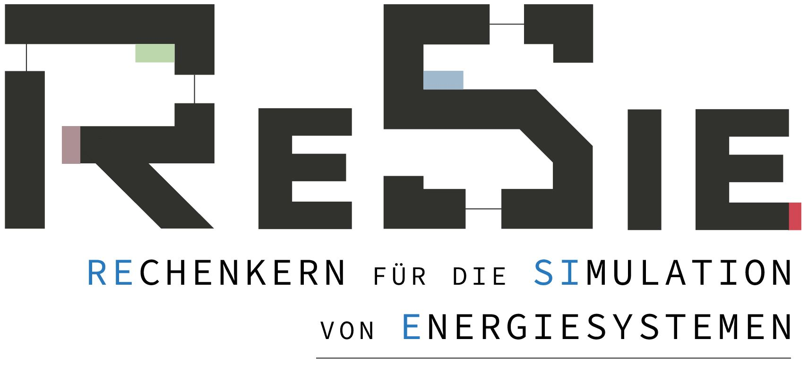
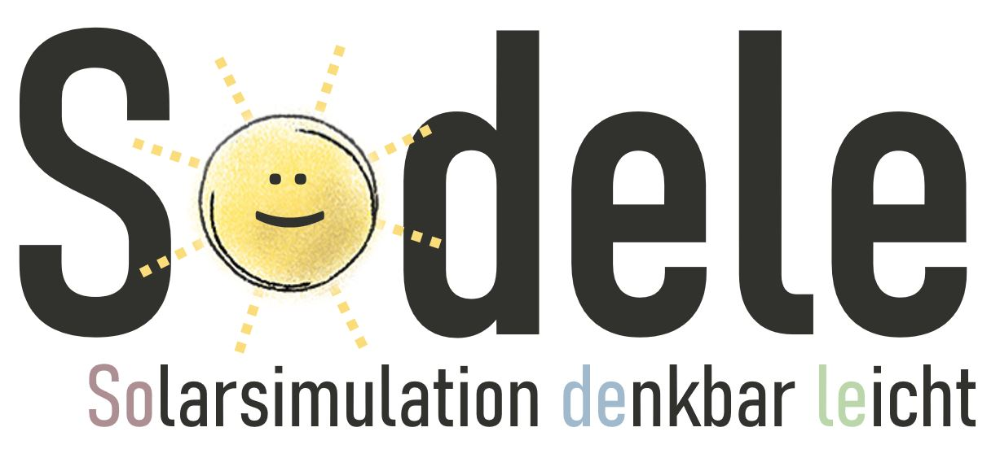

# QuaSi - Overview

The QuaSi simulation software focuses on the energy supply and demand of buildings on the scale of city districts during an early planning stage. The project is split into several software components: The simulation engine ReSiE, user interfaces for both standalone use and integration into BIM tools, as well as additional tools surrounding the use of the simulation engine (see below for details). The documents presented here describe the technical background, usage instructions and developer guidelines for these components.

**DISCLAIMER:** The current version of the documentation is a work in progress as we move towards the first full release of our various tools and software components. Please be aware that some parts of the documentation do not reflect the current state of what they are documenting.

# What's with the name?
The first version of QuaSi was developed as part of a research project in Esslingen - Germany. As the tool grew useful, it needed a catchy name, which is the source of "QuaSi" as an abbreviation of "Quartier" (German for city quarter / district) and "Simulation". Although additional components were added over time and the project is now developed with an international audience in mind, the name stuck around. 

# Components of the QuaSi-Project
Now, QuaSi is understood to be a collection of the following simulation tools:

- **ReSiE** (acronym for "computational engine for the simulation of energy systems", in German "Rechenkern für die Simulation von Energiesystemen"), a simulation tool for the simulation and optimization of different energy supply systems for city districts or single buildings with a focus on operational strategies that can be used in early planning stages ([GitHub Repository](https://github.com/QuaSi-Software/resie))
  
    {: style="height:100px"}

- **GenSim** (acronym for "generic building simulation", in German "Generische Gebäudesimulation") that can perform a thermal building simulation based on EnergyPlus\(^{TM}\) to get energy demands for a variety of buildings and usage
  
    {: style="height:100px"}

- **SoDeLe** (acronym for "Solar simulation as easy as can be", in German "Solarsimulation denkbar leicht"), an easy-to-use tool to calculate energy profiles from photovoltaic systems with different orientations and different PV modules, based on python-pvlib
  
    {: style="height:100px"}

## Funding
This project is funded in majority by a research initiative of the German government (German Federal Ministry for Economic Affairs and Climate Action, BMWK).

