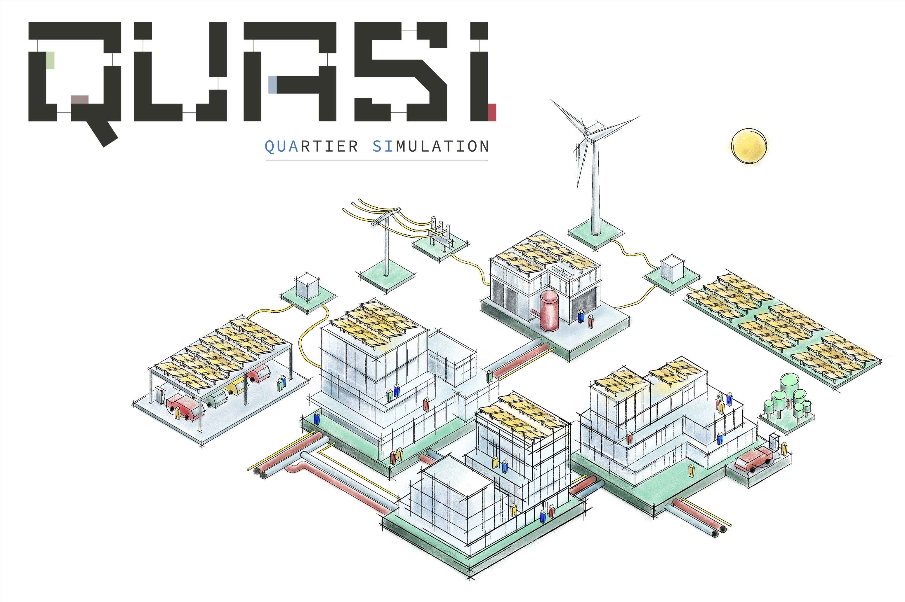
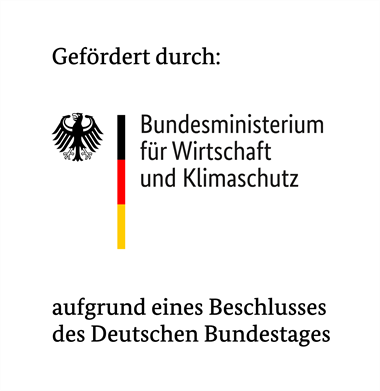

# QuaSi - Overview

The QuaSi simulation software focuses on the energy supply and demand of buildings on the scale of city districts. The project is split into several components: The simulation engine Resie, user interfaces for both standalone use and integration into BIM tools, as well as additional tools surrounding the use of the simulation engine. The documents presented here describe the technical background, usage instructions and developer guidelines for these components.

**DISCLAIMER:** The current version of the documentation is a work in progress as we move towards the first full release of our various tools and software components. Please be aware that some parts of the documentation do not reflect the current state of what they are documenting.

## What's with the name?
QuaSi was developed as part of a research project in Germany. As the tool grew useful, it needed a catchy name, which is the source of "QuaSi" as an abbreviation of "Quartier" (German for city quarter / district) and "Simulation". Although additional components were added over time and the project is now developed with an international audience in mind, the name stuck around.

## Funding
This project is funded in majority by a research initiative of the German government.

