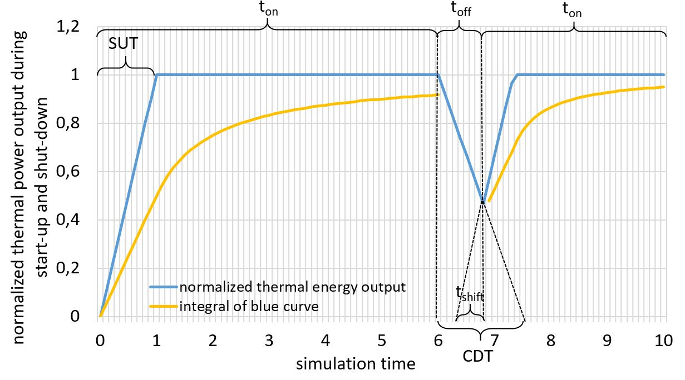

# Transient effects

## Reduction of usable heat during start-up of each component
The reduction of the usable heat output during start-up of a system can be described using either linear oder exponential start-up and cool-down ramps. Both are described in the following.

### Linear transient effects
The following figure illustrate a linear start-up and cool-down behaviour characerized by the start-up time (SUT) and cool-down time (CDT) the system needs to reach full thermal energy output or to cool down completely.

The current thermal power output can be expressed with the following sectionally defined function. The simulation engine tracks the time an energy system is running or not running. The on-time \(t_{on}\) represents the time since the last start-up of the energy system while \(t_{off}\) is the time since the last shut-down. To handle the case when the energy system has not cooled down completely since the last shut-down, the linear start-up curve can be shifted using \(t_{shift}\) to represent a warm start:

$$
 \dot{Q}_{out,current}(t_{on})  = \dot{Q}_{stationary} 
\begin{cases}
 \frac{t_{on}+t_{shift}}{\text{SUT}} & \text{ for } t_{on}+t_{shift} \ < \text{SUT} \\
1 & \text{ for } t_{on}+t_{shift} \ \geq  \text{SUT}
\end{cases} 
$$

The required timeshift \(t_{shift}\) of the warming-up curve can be calculated within the timestep where the energy system is turned on again using the cooling-down curve and the time since the last shut-down:

$$
\dot{Q}_{out,current}(t_{off}) = \text{max} \left ( \dot{Q}_{out,current}(t_{on}) \left ( 1-\frac{t_{off}}{\text{CDT}} \right ),0 \right ) 
$$
that leads with \(\dot{Q}_{out,current}(t_{on}=0) = \dot{Q}_{out,current}(t_{off})\) to 
$$
t_{shift} = \text{max} \left ( \frac{\dot{Q}_{out,current}(t_{on})}{\dot{Q}_{stationary} } \left( \text{SUT} - t_{off} \frac{\text{SUT}}{\text{CDT}} \right ), 0 \right )
$$

With this information, the average thermal power output in the current timestep between \(t_{on,lower}\) and \(t_{on,upper}\) can be calculated using the integral of the sectionally defined function above:

$$
 \dot{Q}_{out} = \frac{\dot{Q}_{stationary}}{t_{on,upper}-t_{on,lower}}
\begin{cases}
 \frac{t_{shift} \ (t_{on,upper}-t_{on,lower}) + \frac{1}{2} \ (t_{on,upper}^2-t_{on,lower}^2)}{\text{SUT}} & \text{ for } t_{on}+t_{shift} \ < \text{SUT} \\
t_{on,upper}-t_{on,lower} & \text{ for } t_{on}+t_{shift} \ \geq  \text{SUT}
\end{cases} 
$$

This integral results in the following yellow curve taht represents the normalized average thermal power output with \(t_{on,lower} = 0\):

Note that \(t_{shift}\) has to be set to zero at the first timestep of the simulation and \(t_{on,lower}\) and \(t_{on,upper}\) have to start couting again at every change of operation (on/off, not part-load).

### Exponencial transient effects
While the method above describes a linear thermal power output during the heat-up of an energy system that requires the integration of sectionally defined functions, the calculation of the time-step averaged thermal power can be also performed using continious exponential functions. This is described for excample in the TRNSYSType 401[^Wetter1996]. The time span for each energy system to heat up is defined by the constant heat-up-time \(\tau_{on}\) and the cool-down time \(\tau_{off}\). This is not the same time span as defined above (SUT and CDT) for the linear warm-up! The following figure shows an exemplary operation curve, analogous to the one for linear transient effects above. An energy system is started from a cool basis, heated up to nominal thermal power output, then shut down and restarted before the system has cooled down completely.

The calculation of the reduced heat output due to transient effects at current time \(t_{on}\) since the last start of the energy system and with the constant heat-up-time \(\tau_{on}\) of each energy system can be calculated with the following expression:
$$
\dot{Q}_{out,current}(t_{on}) = \dot{Q}_{stationary} \left (1 - e^{-\frac{t_{on}}{\tau_{on}}} \right )
$$

If the system has not been cooled town completely since the last shut-down, the heat-up losses can be calculated using the following equation with \(t_{shift}\) representing the time shift for the exponential function (compare to figure above).
$$
\dot{Q}_{out,current}(t_{on}) = \dot{Q}_{stationary} \left (1 - e^{-\frac{t_{shift} + t_{on}}{\tau_{on}}} \right )
\ \ \text{  with  } \ \ t_{shift} = - \tau_{on} \ ln \left ( 1-\frac{\dot{Q}_{out,current}(t_{off})}{\dot{Q}_{stationary}} \right )
$$

The cool-down curve is calculated analogously in order to get the current state of the system in the case of restart in the next time step.
$$
\dot{Q}_{out,current}(t_{off}) = \dot{Q}_{stationary} \left (e^{-\frac{t_{shift}+t_{off}}{\tau_{off}}} \right ) \ \ \text{  with  } \ \ t_{shift} = - \tau_{off} \ ln \left ( 1-\frac{\dot{Q}_{out,current}(t_{on})}{\dot{Q}_{stationary}} \right )
$$

To get the average thermal energy output within the current timestep between \(t_{on,lower}\) and \(t_{on,upper}\), an integration of the exponential function is needed. According to the TRNSYS Type 401[^Wetter1996], this leads to

$$
\dot{Q}_{out} = \dot{Q}_{stationary} \left ( 1 + \frac{\tau_{on}}{t_{on,upper}-t_{on,lower}} \ e^{-\frac{t_{shift}}{\tau_{on}}} \ \left ( e^{-\frac{t_{on,upper}}{\tau_{on}}} - e^{-\frac{t_{on,lower}}{\tau_{on}}} \right )   \right )
$$

[^Wetter1996]: Wetter M., Afjei T.: TRNSYS Type 401 - Kompressionswärmepumpe inklusive Frost- und Taktverluste. Modellbeschreibung und Implementation in TRNSYS (1996). Zentralschweizerisches Technikum Luzern, Ingenieurschule HTL. URL: [https://trnsys.de/static/05dea6f31c3fc32b8db8db01927509ce/ts_type_401_de.pdf](https://trnsys.de/static/05dea6f31c3fc32b8db8db01927509ce/ts_type_401_de.pdf)